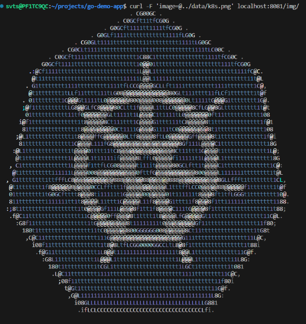

# Minimum Viable Product (MVP):

Для того щоб виконати наступні кроки ArgoCD повинно бути встановлене та користувач має мати доступ до основної сторінки веб інтерфейсу

1. Перевіряємо роботу застосунку AsciiArtify
- Переадресуємо порти командою:
`bash
$ kubectl port-forward -n demo svc/ambassador 8081:80
Forwarding from 127.0.0.1:8081 -> 80
Forwarding from [::1]:8081 -> 80
`
- Перевіримо версію додатку виконавши запит на вказаний вище порт:
`bash
$ curl localhost:8081
k8sdiy-api:599e1af
`
2. Перевіримо роботу застосунку
- Для цього завантажимо файл що зберігається у нас в локальному сховищі на віддалений сервер:
`bash
$ curl -F 'image=@../data/k8s.png' localhost:8081/img/
`
- Отримаємо результат прямо в консолі:

 

